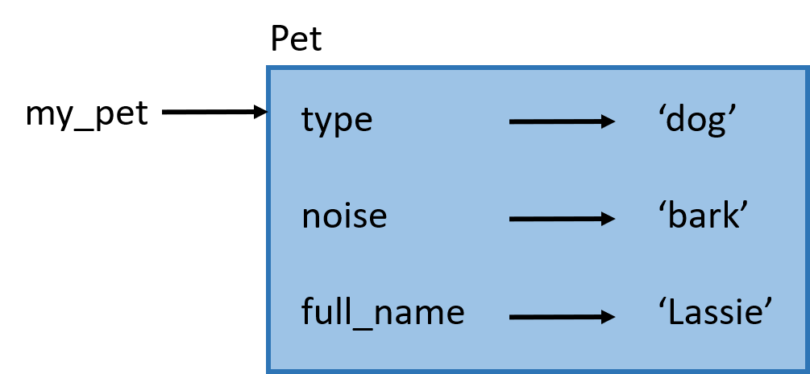

# Lesson 7.01: User-Defined Types (Classes)

## Learning Objectives

Students will be able to...

* Define and identify: **class**, **instance**, **object**, **attribute**.
* Create a class and instantiate.
* Add attributes to an instance.
* Create an embedded object.
* Manipulate instances and attributes through a function.

## Materials/Preparation

* [7.01 Slide Deck](https://github.com/TEALSK12/2nd-semester-introduction-to-computer-science/raw/master/units/7_unit/slidedecks/Intro%20Python%207.01%20TEALS.pptx)
* [Do Now][]
* [Example][]
* [Lab][] ([docx][]) ([pdf][])
* [Associated Reading](https://tealsk12.github.io/2nd-semester-introduction-to-computer-science/readings.md#associatedreadings/7.1)
* Read through the do now, lesson, and lab so that you are familiar with the requirements and can assist students

## Pacing Guide

| **Duration**   | **Description** |
| ---------- | ----------- |
| 5 Minutes  | Do Now      |
| 10 Minutes | Lesson      |
| 35 Minutes | Lab         |
| 5 Minutes | Discussion  |

## Instructor's Notes

### 1. Do Now

* Display the [Do Now][].
* Give the students at least five minutes to think about the questions posed in the [Do Now][].
* This might be a good time for a think-pair-share.

### 2. Lesson

#### Discuss the Do Now

* Ask the students what data type they thought would be helpful.
* They probably noticed that this was going to be difficult to do concisely without some other data type.
* Acknowledge that we need something that says "I am type Pet, which has three different qualities or attributes".

#### Instruction - Class

* A **class** is a user-defined type.
* Syntax for creating a **class**:

    ```python
    class Pet:
        """Represents a pet."""
    ```

#### Instruction - Instantiation and Objects

* You can create an **instance** by calling the class as if it were a function. Usually the instance is named by assigning it to a variable.

    ```python
    my_pet = Pet()
    ```

* If you check the type of the instance it will be `Pet`.
* Instances are mutable, they can be changed or updated.
* An instance can also be referred to as an **object**.
* Objects form the basis for object-oriented programming.

#### Demonstration

* Show [Example] on board to demonstrate the `Pet` class.
* Ask students what the difference is between this and the [Do Now][].
* Have the students identify where the class is created.
* Next have the students identify where the class is instantiated.
* Ask students what they think `pet.full_name` will do.
* This is a good time to explain the concept of an attribute.

#### Instruction - Attribute

* Values assigned to an instance are **attributes** of those objects. As an example:

    ```python
    class Pet:
        """Represents a pet."""

    my_pet = Pet()
    my_pet.type = 'dog'
    my_pet.noise = 'bark'
    my_pet.full_name = 'Lassie'
    ```

* An object can be visualized with an **object diagram**.



* Objects can be attributes for another object. These are **embedded objects**. The following example illustrates this.

    ```python
    class Pet:
        """Represents a pet."""

    class Owner:
        """Represents a pet owner."""

    # Instantiate a pet.
    my_pet = Pet()
    my_pet.type = 'unicorn'
    my_pet.noise = 'neigh'
    my_pet.full_name = 'Rainbow'
    my_pet.owner = Owner()
    me.owner.full_name = 'Princess Firebolt'
    ```

* An object diagram for an embedded object looks like the following.


#### Instruction - Debugging objects

* Objects have their own unique bugs that can arise.
  * Declaring a class without any code in the body (even if that code is the docstring, which is good practice anyhow), will throw a syntax error.
  * Calling an attribute that hasn't been defined will throw an attribute error.

### 3. Lab

* Have the students work on the lab described in the handout.
* In the lab, the students will create classes, objects, attributes and functions that take objects as arguments.

### 4. Debrief

* Write down any questions you still have about the new terms you learned today?
* Is there anything that needs more clarification?

## Accommodation/Differentiation

Given the big leap taken today with much new terminology and challenging concepts, it's quite possible students will need additional class time to digest the information and finish the lab.

For students that are quickly picking up the concepts, have them create their own unique class or have them help explain to struggling students with their own examples what a class, object, instance, or attribute is.

[Do Now]:do_now.md
[Lab]:lab.md
[Example]:example.md
[pdf]: https://github.com/TEALSK12/2nd-semester-introduction-to-computer-science/raw/master/units/7_unit/01_lesson/lab.pdf
[docx]: https://github.com/TEALSK12/2nd-semester-introduction-to-computer-science/raw/master/units/7_unit/01_lesson/lab.docx
